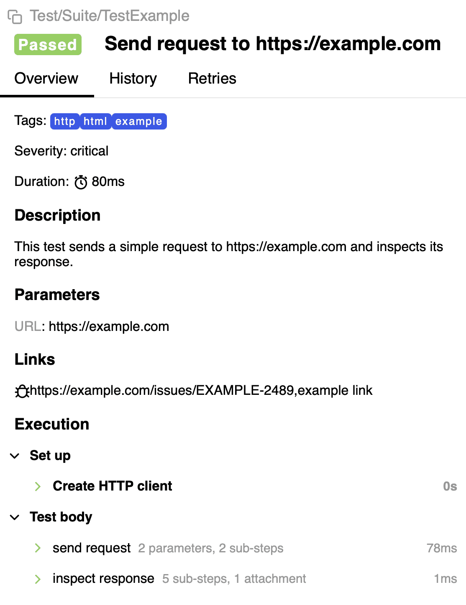

# 📊 Testo Allure Plugin

[](https://pkg.go.dev/github.com/ozontech/testo-alure)



An [Allure report](https://allurereport.org/) plugin for [Testo framework](https://github.com/ozontech/testo).

> Allure Report is a popular open source tool for visualizing the results of a test run.
> It can be added to your testing workflow with little to zero configuration.
> It produces reports that can be opened anywhere and can be read by anyone, no deep technical knowledge required.

## Quick Start

Install:

```bash
go get github.com/ozontech/testo-allure
```

Use:

```go
type T struct {
	*testo.T
	*allure.PluginAllure
}

type Suite struct{ testo.Suite[T] }

func (Suite) TestFoo(t T) {
	t.Title("Example Test")
	t.Description("My first _Allure_ test with **testo**")
	t.Tags("testo", "example", "allure")

	allure.Step(t, "first step", func(t T) {
		t.Log("it works")
	})
}
```

See also [other examples](./examples).

## Testplan

This plugin supports test plans.

See [Selective tests run integration](https://docs.qameta.io/allure-testops/ecosystem/allurectl/#selective-tests-run-integration)

### Allure ID

When applying a test plan Allure plugin needs to know test's [Allure ID](https://help.qameta.io/support/solutions/articles/101000480600-cooking-the-allureid) before running it.
Otherwise, it will have to rely on test's full name, rather than allure id.

```go
func (Suite) TestFoo(t T) {
    t.ID("12345")
}
```

Use annotations to make allure id avaiable during tests collection:

```go
var _ = testo.For(Suite.TestFoo, allure.WithID("12345"))

func (Suite) TestFoo(t T) {
    // ...
}
```

## Flags

Allure plugin provides the following CLI flags:

```txt
-allure.dir string
    Path to the directory where Allure will save the test results. If the directory does not exist, it will be created. (default: "allure-results")

-allure.invert bool
    Only run the tests that do not match the conditions specified by the test plan. (default: false)
```

Example:

```shell
go test . -allure.dir /some/custom/dir/my-allure-results
```

## Asserts

[Testify]-based asserts are available with `t.Assert` and `t.Require` functions.

Each assertion call is reflected in the allure report as steps with parameters.

For example, the following code:

```go
t.Require().Equal(4, 2+2)
t.Assert().True(false)
```

Is converted to the following steps:

```txt
require: equal
    expected: 4
    actual:   4

assert: true
    value: false
```

## Steps and sub-tests

Allure plugin provides step abstraction.

Both, sub-tests and steps are shown in allure report as steps under parent test.
However, `allure.Step` has some differences.

1. Fatal errors are propagated to the parent. Fatal errors are triggered by the `t.FailNow()` function, commonly called from `t.Fatal`.
2. Context returned by the `t.Context` inside step will be cancelled when parent context does.

Example:

```go
func (Suite) TestStep(t T) {
    // trigger fatal error
    allure.Step(t, "first", func(t T) { t.FailNow() })

    // ❌ this code won't be executed
    t.Log("Hi")
}

func (Suite) TestRun(t T) {
    // trigger fatal error
    testo.Run(t, "first", func(t T) { t.FailNow() })

    // ✅ this code will be executed
    t.Log("Hi")
}
```

## Attachments

Allure plugin features an efficient hashsum-based attachment deduplication mechanism.

It will automatically keep track of written attachments so that a single attachment added, say, 100 times, will result
a single file referenced across all report.

This feature is disabled by default, as [Allure does not currently support it](https://github.com/orgs/allure-framework/discussions/3159#discussioncomment-15230835).
But it can be enabled with `WithDeduplicateAttachments` option, if you need it.

```go
func init() {
    testo.Option(
        allure.WithDeduplicateAttachments(true),
    )
}
```

## Options

This plugin provides several options for configuring default behavior.

See [options.go](./options.go) for a list of all available options.

[Testify]: https://github.com/stretchr/testify
